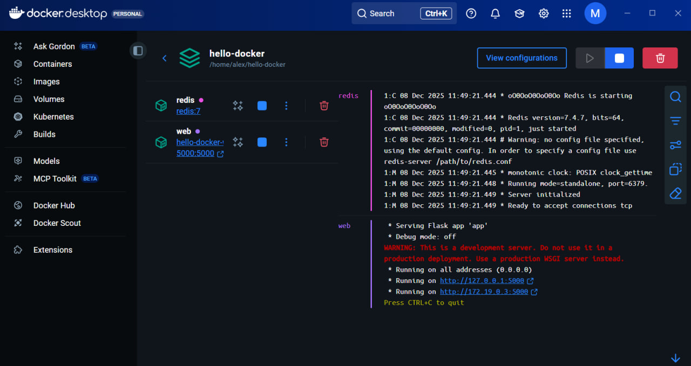
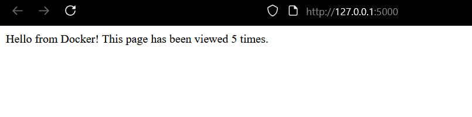

# Лабораторна робота №9

### Тема: «Робота з Dockerfile та Docker Compose»
### Мета: Навчитися працювати з директивами Dockerfile і запускати багатосервісний застосунок (Flask + Redis) за допомогою Docker Compose.

## Демонстрація роботи
Запущений контейнер в Docker Desktop

Лічильник у браузері

## Висновки
У результаті роботи вийшов повністю працюючий веб-додаток на Flask та Redis, який налаштований у Dockerfile та docker-compose для самостійної роботи всередині контейнера.
